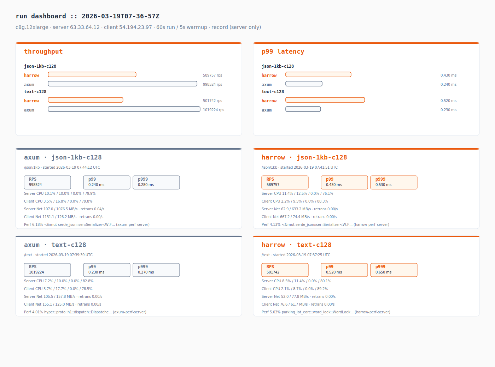
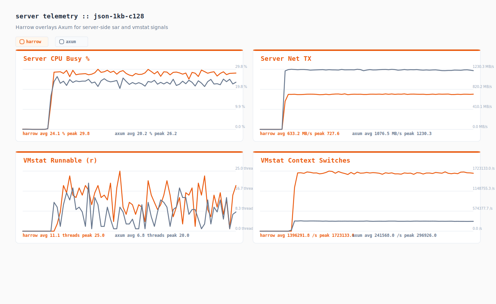
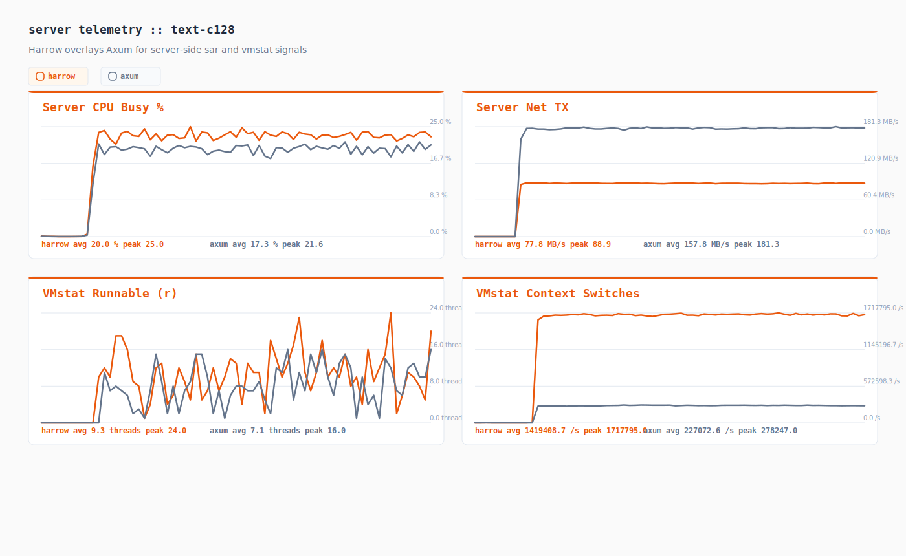
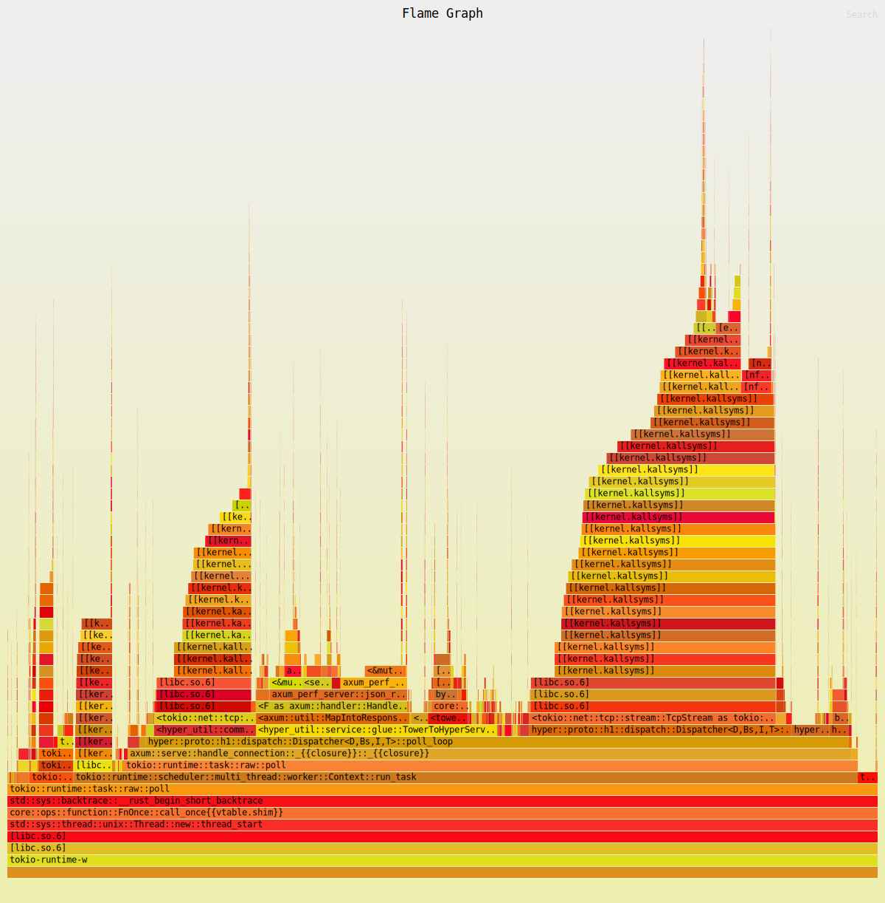
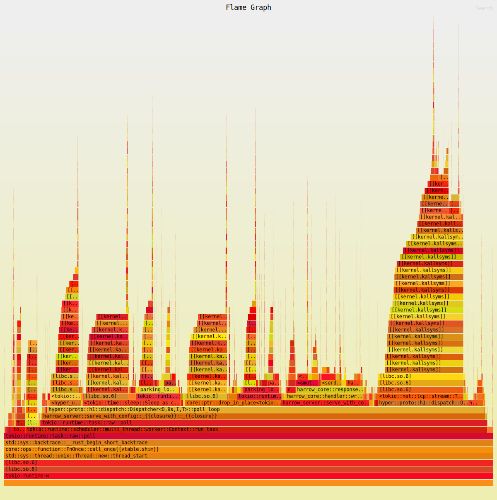
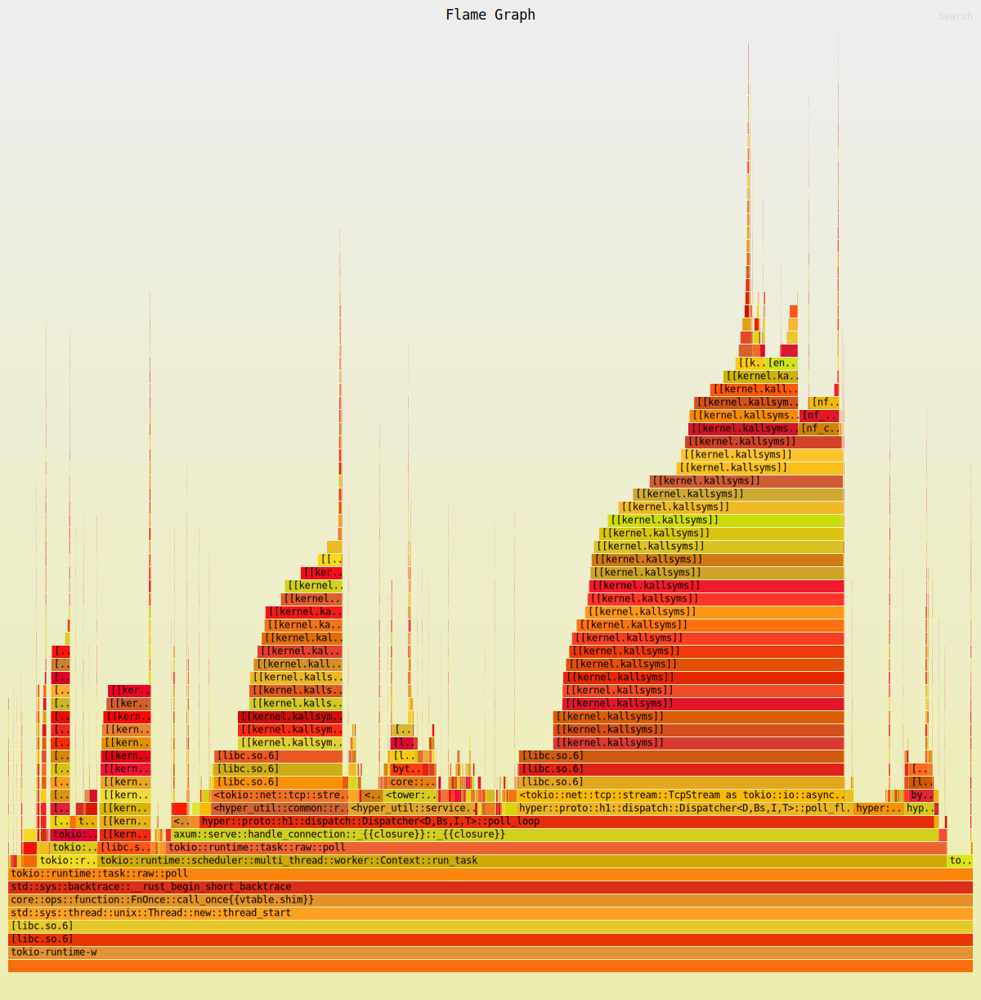
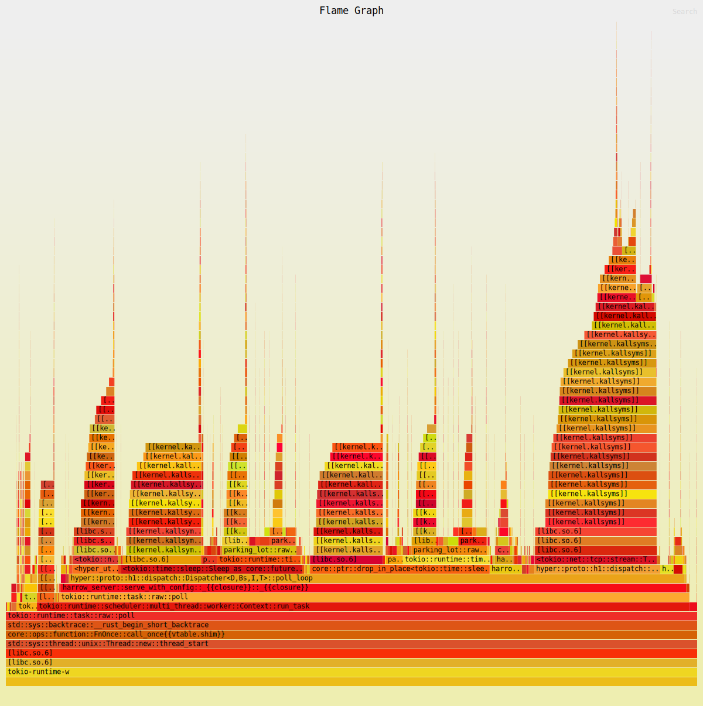

# Performance Test Results

Instance: c8g.12xlarge
Server: 63.33.64.12
Client: 54.194.23.97
Duration: 60s | Warmup: 5s
Spinr mode: docker
OS monitors: true
Perf: record (server only)
Date: 2026-03-19 07:45:18 UTC

## Runs

| Test case | Framework | Path | Concurrency | RPS | p50 (ms) | p99 (ms) | p999 (ms) |
|-----------|-----------|------|-------------|-----|----------|----------|-----------|
| json-1kb-c128 | axum | /json/1kb | 128 | 998524.180 | 0.120 | 0.240 | 0.280 |
| json-1kb-c128 | harrow | /json/1kb | 128 | 589757.170 | 0.210 | 0.430 | 0.530 |
| text-c128 | axum | /text | 128 | 1019224.030 | 0.120 | 0.230 | 0.270 |
| text-c128 | harrow | /text | 128 | 501742.230 | 0.250 | 0.520 | 0.650 |

## Comparison

| Test case | Harrow RPS | Axum RPS | Delta % | Harrow p99 (ms) | Axum p99 (ms) |
|-----------|------------|----------|---------|------------------|---------------|
| json-1kb-c128 | 589757.170 | 998524.180 | -40.94% | 0.430 | 0.240 |
| text-c128 | 501742.230 | 1019224.030 | -50.77% | 0.520 | 0.230 |

## Telemetry Digest

| Run | Server CPU (user/sys/wait/idle) | Client CPU (user/sys/wait/idle) | Server Net (rx/tx MB/s, retrans/s) | Client Net (rx/tx MB/s, retrans/s) | Top Perf Hotspot |
|-----|----------------------------------|----------------------------------|------------------------------------|------------------------------------|------------------|
| axum_json_1kb_c128 | 10.1% / 10.0% / 0.0% / 79.9% | 3.5% / 16.8% / 0.0% / 79.8% | 107.0 / 1076.5 MB/s · retrans 0.04/s | 1131.1 / 126.2 MB/s · retrans 0.00/s | 6.18% <&mut serde_json::ser::Serializer<W,F> as serde_core::ser::Serializer>::serialize_str (axum-perf-server) |
| harrow_json_1kb_c128 | 11.4% / 12.5% / 0.0% / 76.1% | 2.2% / 9.5% / 0.0% / 88.3% | 62.9 / 633.2 MB/s · retrans 0.00/s | 667.2 / 74.4 MB/s · retrans 0.00/s | 4.13% <&mut serde_json::ser::Serializer<W,F> as serde_core::ser::Serializer>::serialize_str (harrow-perf-server) |
| axum_text_c128 | 7.2% / 10.0% / 0.0% / 82.8% | 3.7% / 17.7% / 0.0% / 78.5% | 105.5 / 157.8 MB/s · retrans 0.00/s | 155.1 / 125.0 MB/s · retrans 0.00/s | 4.01% hyper::proto::h1::dispatch::Dispatcher<D,Bs,I,T>::poll_loop (axum-perf-server) |
| harrow_text_c128 | 8.5% / 11.4% / 0.0% / 80.1% | 2.1% / 8.7% / 0.0% / 89.2% | 52.0 / 77.8 MB/s · retrans 0.00/s | 76.6 / 61.7 MB/s · retrans 0.00/s | 5.03% parking_lot_core::word_lock::WordLock::lock_slow (harrow-perf-server) |

## Telemetry Charts

### json-1kb-c128

### text-c128

## Artifacts

| Run | JSON | Perf Report | Perf Script | Perf SVG | Server CPU | Server Net | Client CPU | Client Net |
|-----|------|-------------|-------------|----------|------------|------------|------------|------------|
| axum_json_1kb_c128 | [json](./axum_json_1kb_c128.json) | [perf-report](./axum_json_1kb_c128.server.perf-report.txt) | [perf-script](./axum_json_1kb_c128.server.perf.script) | [perf.svg](./axum_json_1kb_c128.server.perf.svg) | [server cpu](./axum_json_1kb_c128.server.sar-u.txt) | [server net](./axum_json_1kb_c128.server.sar-net.txt) | [client cpu](./axum_json_1kb_c128.client.sar-u.txt) | [client net](./axum_json_1kb_c128.client.sar-net.txt) |
| harrow_json_1kb_c128 | [json](./harrow_json_1kb_c128.json) | [perf-report](./harrow_json_1kb_c128.server.perf-report.txt) | [perf-script](./harrow_json_1kb_c128.server.perf.script) | [perf.svg](./harrow_json_1kb_c128.server.perf.svg) | [server cpu](./harrow_json_1kb_c128.server.sar-u.txt) | [server net](./harrow_json_1kb_c128.server.sar-net.txt) | [client cpu](./harrow_json_1kb_c128.client.sar-u.txt) | [client net](./harrow_json_1kb_c128.client.sar-net.txt) |
| axum_text_c128 | [json](./axum_text_c128.json) | [perf-report](./axum_text_c128.server.perf-report.txt) | [perf-script](./axum_text_c128.server.perf.script) | [perf.svg](./axum_text_c128.server.perf.svg) | [server cpu](./axum_text_c128.server.sar-u.txt) | [server net](./axum_text_c128.server.sar-net.txt) | [client cpu](./axum_text_c128.client.sar-u.txt) | [client net](./axum_text_c128.client.sar-net.txt) |
| harrow_text_c128 | [json](./harrow_text_c128.json) | [perf-report](./harrow_text_c128.server.perf-report.txt) | [perf-script](./harrow_text_c128.server.perf.script) | [perf.svg](./harrow_text_c128.server.perf.svg) | [server cpu](./harrow_text_c128.server.sar-u.txt) | [server net](./harrow_text_c128.server.sar-net.txt) | [client cpu](./harrow_text_c128.client.sar-u.txt) | [client net](./harrow_text_c128.client.sar-net.txt) |

## Flamegraphs

### axum_json_1kb_c128

### harrow_json_1kb_c128

### axum_text_c128

### harrow_text_c128

