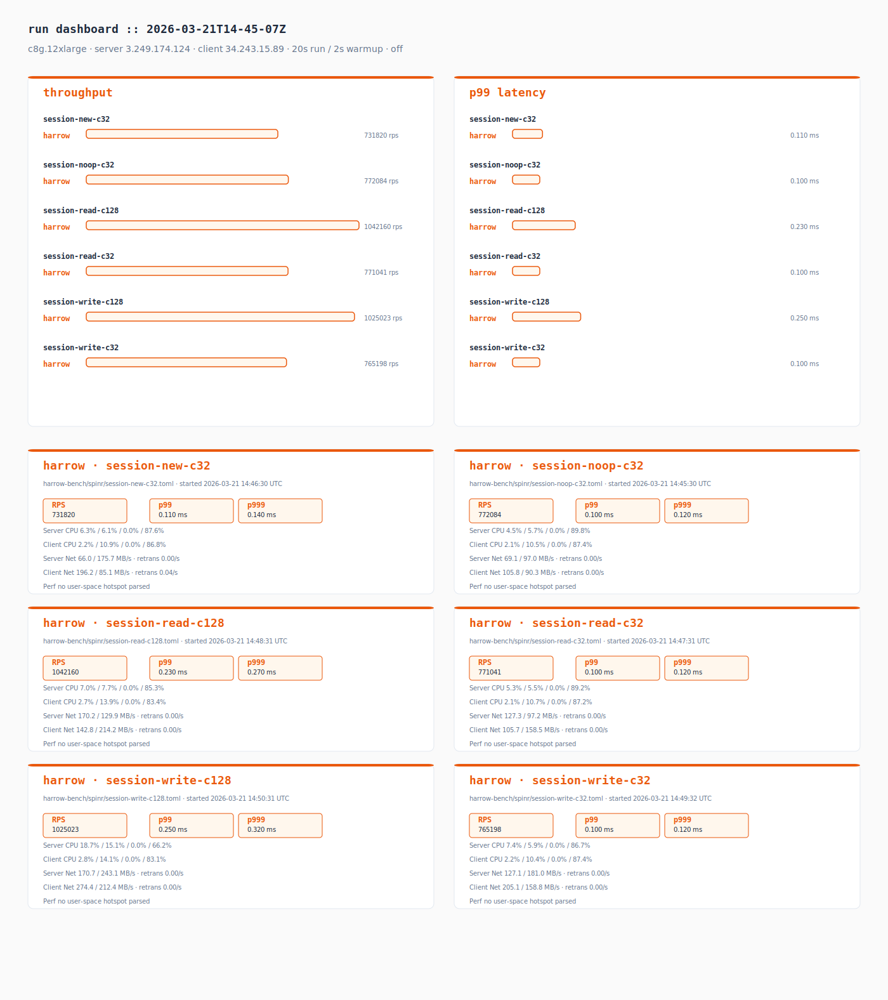
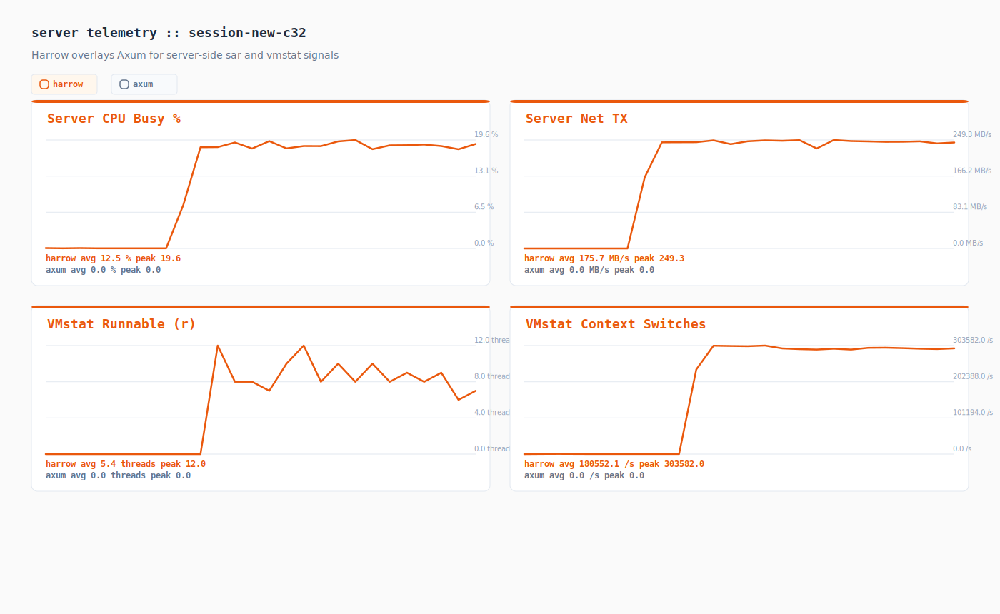
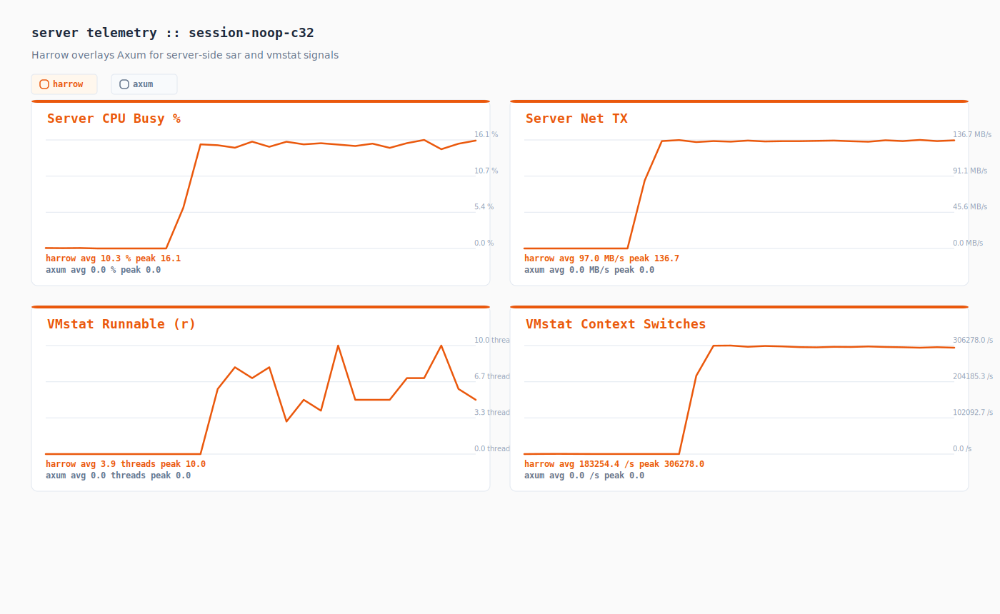
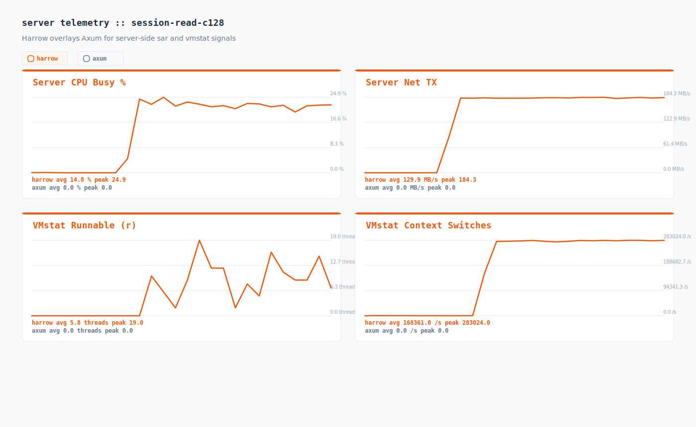
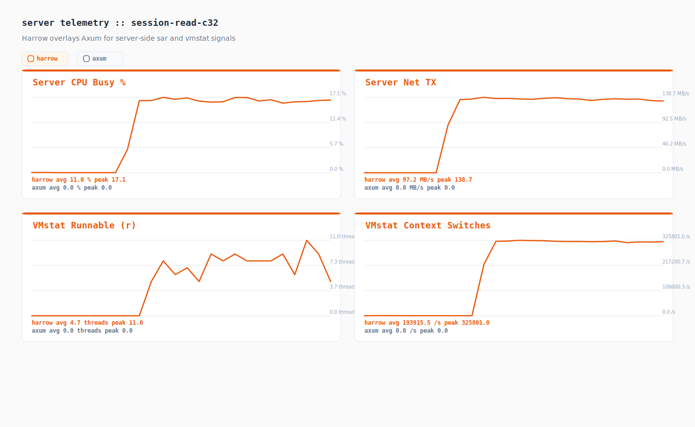
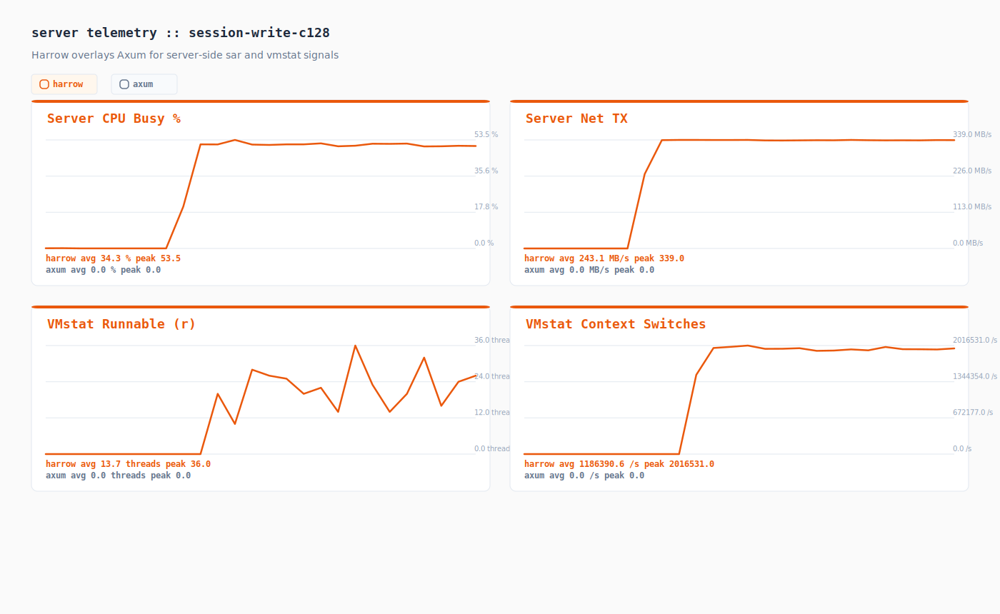
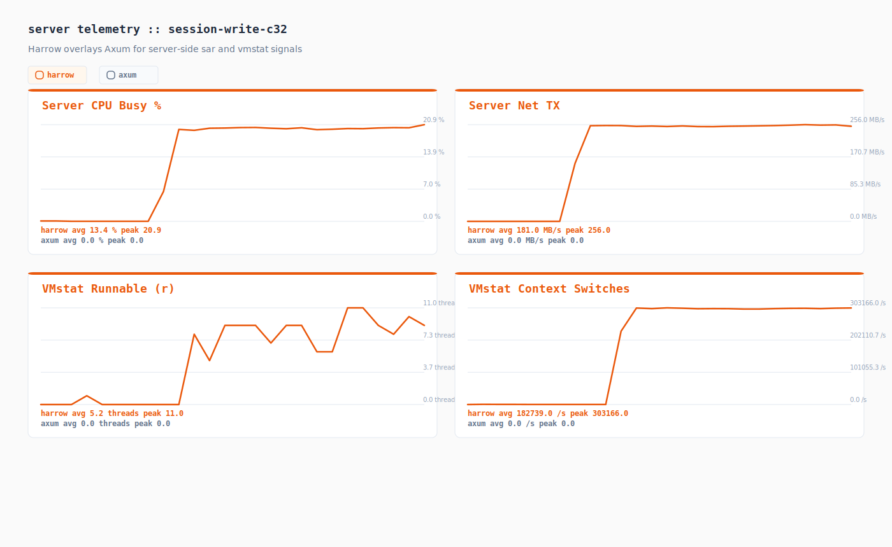

# Performance Test Results

Instance: c8g.12xlarge
Server: 3.249.174.124
Client: 34.243.15.89
Duration: 20s | Warmup: 2s
Spinr mode: docker
OS monitors: true
Perf: off
Date: 2026-03-21 14:50:54 UTC

## Runs

| Test case | Framework | Path | Concurrency | RPS | p50 (ms) | p99 (ms) | p999 (ms) |
|-----------|-----------|------|-------------|-----|----------|----------|-----------|
| session-new-c32 | harrow | harrow-bench/spinr/session-new-c32.toml | 0 | 731819.800 | 0.060 | 0.110 | 0.140 |
| session-noop-c32 | harrow | harrow-bench/spinr/session-noop-c32.toml | 0 | 772083.950 | 0.060 | 0.100 | 0.120 |
| session-read-c128 | harrow | harrow-bench/spinr/session-read-c128.toml | 0 | 1042160.450 | 0.120 | 0.230 | 0.270 |
| session-read-c32 | harrow | harrow-bench/spinr/session-read-c32.toml | 0 | 771041.050 | 0.060 | 0.100 | 0.120 |
| session-write-c128 | harrow | harrow-bench/spinr/session-write-c128.toml | 0 | 1025023.050 | 0.120 | 0.250 | 0.320 |
| session-write-c32 | harrow | harrow-bench/spinr/session-write-c32.toml | 0 | 765197.700 | 0.060 | 0.100 | 0.120 |

## Comparison

| Test case | Harrow RPS | Axum RPS | Delta % | Harrow p99 (ms) | Axum p99 (ms) |
|-----------|------------|----------|---------|------------------|---------------|
| session-new-c32 | 731819.800 | - | +0.00% | 0.110 | - |
| session-noop-c32 | 772083.950 | - | +0.00% | 0.100 | - |
| session-read-c128 | 1042160.450 | - | +0.00% | 0.230 | - |
| session-read-c32 | 771041.050 | - | +0.00% | 0.100 | - |
| session-write-c128 | 1025023.050 | - | +0.00% | 0.250 | - |
| session-write-c32 | 765197.700 | - | +0.00% | 0.100 | - |

## Telemetry Digest

| Run | Server CPU (user/sys/wait/idle) | Client CPU (user/sys/wait/idle) | Server Net (rx/tx MB/s, retrans/s) | Client Net (rx/tx MB/s, retrans/s) | Top Perf Hotspot |
|-----|----------------------------------|----------------------------------|------------------------------------|------------------------------------|------------------|
| harrow_session-new-c32 | 6.3% / 6.1% / 0.0% / 87.6% | 2.2% / 10.9% / 0.0% / 86.8% | 66.0 / 175.7 MB/s · retrans 0.00/s | 196.2 / 85.1 MB/s · retrans 0.04/s | - |
| harrow_session-noop-c32 | 4.5% / 5.7% / 0.0% / 89.8% | 2.1% / 10.5% / 0.0% / 87.4% | 69.1 / 97.0 MB/s · retrans 0.00/s | 105.8 / 90.3 MB/s · retrans 0.00/s | - |
| harrow_session-read-c128 | 7.0% / 7.7% / 0.0% / 85.3% | 2.7% / 13.9% / 0.0% / 83.4% | 170.2 / 129.9 MB/s · retrans 0.00/s | 142.8 / 214.2 MB/s · retrans 0.00/s | - |
| harrow_session-read-c32 | 5.3% / 5.5% / 0.0% / 89.2% | 2.1% / 10.7% / 0.0% / 87.2% | 127.3 / 97.2 MB/s · retrans 0.00/s | 105.7 / 158.5 MB/s · retrans 0.00/s | - |
| harrow_session-write-c128 | 18.7% / 15.1% / 0.0% / 66.2% | 2.8% / 14.1% / 0.0% / 83.1% | 170.7 / 243.1 MB/s · retrans 0.00/s | 274.4 / 212.4 MB/s · retrans 0.00/s | - |
| harrow_session-write-c32 | 7.4% / 5.9% / 0.0% / 86.7% | 2.2% / 10.4% / 0.0% / 87.4% | 127.1 / 181.0 MB/s · retrans 0.00/s | 205.1 / 158.8 MB/s · retrans 0.00/s | - |

## Telemetry Charts

### session-new-c32

### session-noop-c32

### session-read-c128

### session-read-c32

### session-write-c128

### session-write-c32

## Artifacts

| Run | JSON | Perf Report | Perf Script | Perf SVG | Server CPU | Server Net | Client CPU | Client Net |
|-----|------|-------------|-------------|----------|------------|------------|------------|------------|
| harrow_session-new-c32 | [json](./harrow_session-new-c32.json) | [perf-report](./harrow_session-new-c32.server.perf-report.txt) | [perf-script](./harrow_session-new-c32.server.perf.script) | - | [server cpu](./harrow_session-new-c32.server.sar-u.txt) | [server net](./harrow_session-new-c32.server.sar-net.txt) | [client cpu](./harrow_session-new-c32.client.sar-u.txt) | [client net](./harrow_session-new-c32.client.sar-net.txt) |
| harrow_session-noop-c32 | [json](./harrow_session-noop-c32.json) | [perf-report](./harrow_session-noop-c32.server.perf-report.txt) | [perf-script](./harrow_session-noop-c32.server.perf.script) | - | [server cpu](./harrow_session-noop-c32.server.sar-u.txt) | [server net](./harrow_session-noop-c32.server.sar-net.txt) | [client cpu](./harrow_session-noop-c32.client.sar-u.txt) | [client net](./harrow_session-noop-c32.client.sar-net.txt) |
| harrow_session-read-c128 | [json](./harrow_session-read-c128.json) | [perf-report](./harrow_session-read-c128.server.perf-report.txt) | [perf-script](./harrow_session-read-c128.server.perf.script) | - | [server cpu](./harrow_session-read-c128.server.sar-u.txt) | [server net](./harrow_session-read-c128.server.sar-net.txt) | [client cpu](./harrow_session-read-c128.client.sar-u.txt) | [client net](./harrow_session-read-c128.client.sar-net.txt) |
| harrow_session-read-c32 | [json](./harrow_session-read-c32.json) | [perf-report](./harrow_session-read-c32.server.perf-report.txt) | [perf-script](./harrow_session-read-c32.server.perf.script) | - | [server cpu](./harrow_session-read-c32.server.sar-u.txt) | [server net](./harrow_session-read-c32.server.sar-net.txt) | [client cpu](./harrow_session-read-c32.client.sar-u.txt) | [client net](./harrow_session-read-c32.client.sar-net.txt) |
| harrow_session-write-c128 | [json](./harrow_session-write-c128.json) | [perf-report](./harrow_session-write-c128.server.perf-report.txt) | [perf-script](./harrow_session-write-c128.server.perf.script) | - | [server cpu](./harrow_session-write-c128.server.sar-u.txt) | [server net](./harrow_session-write-c128.server.sar-net.txt) | [client cpu](./harrow_session-write-c128.client.sar-u.txt) | [client net](./harrow_session-write-c128.client.sar-net.txt) |
| harrow_session-write-c32 | [json](./harrow_session-write-c32.json) | [perf-report](./harrow_session-write-c32.server.perf-report.txt) | [perf-script](./harrow_session-write-c32.server.perf.script) | - | [server cpu](./harrow_session-write-c32.server.sar-u.txt) | [server net](./harrow_session-write-c32.server.sar-net.txt) | [client cpu](./harrow_session-write-c32.client.sar-u.txt) | [client net](./harrow_session-write-c32.client.sar-net.txt) |
